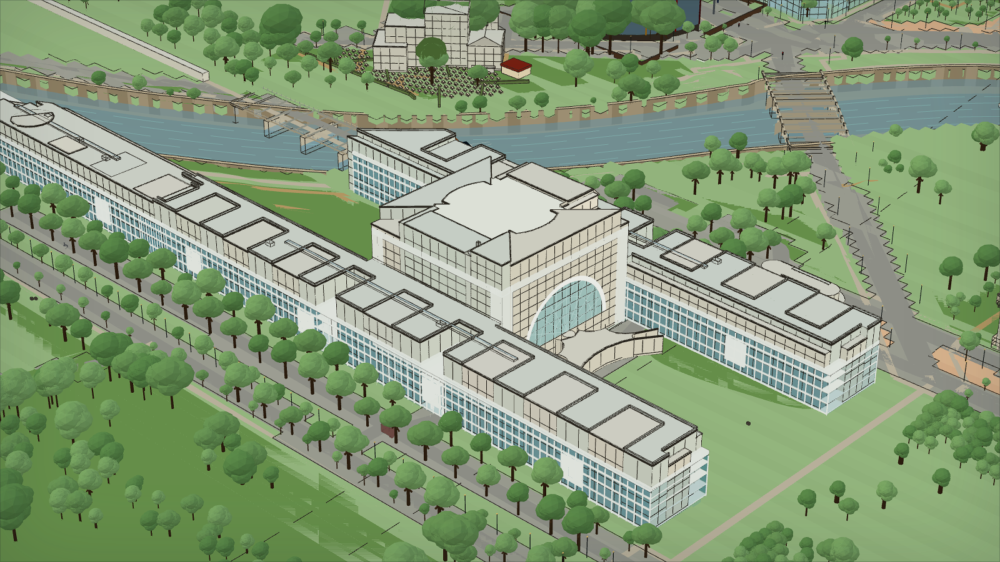
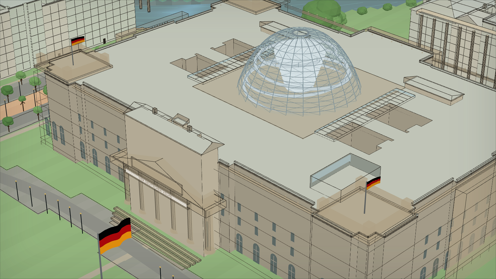
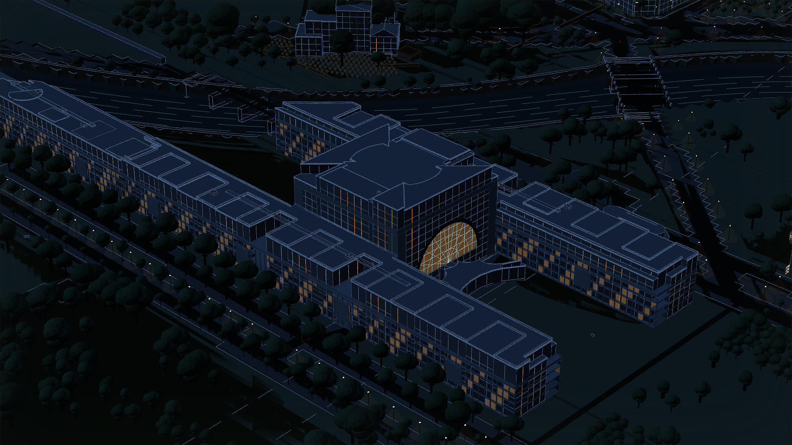

# Isometric Berlin – Regierungsviertel

## Web viewer & Downloads

| What | Link |
|---|---|
| **Open the hosted viewer** | https://klotzkette.github.io/isometric-berlin/ |
| **Download ZIP for Mac/Windows/Linux** | https://github.com/Klotzkette/isometric-berlin/releases/latest/download/isometric-berlin-regierungsviertel-local.zip |
| Versioned v0.71.27 ZIP | https://github.com/Klotzkette/isometric-berlin/releases/download/v0.71.27/isometric-berlin-regierungsviertel-local.zip |
| Latest release page | https://github.com/Klotzkette/isometric-berlin/releases/latest |
| **Public repository / öffentliches Repository** | **https://github.com/Klotzkette/isometric-berlin** |
| Local start instructions | [Run locally / Lokal starten](#run-locally) |
| Package manifest in the ZIP | `package-manifest.json` |

The downloadable viewer is the built React + Three.js/OpenSeadragon app from
`src/app/`. It defaults directly to the drawn isometric 3D view and works on modern
desktop, phone and tablet browsers. No AI model, Google key or paid service is
needed at runtime. The same functional viewer is deployed on GitHub Pages and
bundled with all required local assets in the release ZIP.

`START-HERE.html` is the zero-server **2D compatibility fallback**, not the
full model. For true 3D on Windows, double-click `start-windows.bat`. On macOS
or Linux, run `python3 serve-local.py` in the extracted folder; it opens the
3D viewer directly. The distinction is explicit in the package so the old
flat renderer cannot be mistaken for current 3D quality.

**Status:** Public open-data project · **Local v0.71.27** · hosted viewer and a
complete local package for macOS, Windows, and Linux.

## Screenshots

| Bundeskanzleramt (day) | Reichstag building (day) |
|---|---|
|  |  |



## What this repository is / Was dieses Repository ist

| English | Deutsch |
|---|---|
| This public repository contains the complete React/Three.js viewer, Python geodata pipeline, bounded Regierungsviertel source manifests, tests, documentation, generated WebGL assets, and reproducible release tooling. | Dieses öffentliche Repository enthält den vollständigen React/Three.js-Viewer, die Python-Geodatenpipeline, begrenzte Quellenmanifeste des Regierungsviertels, Tests, Dokumentation, erzeugte WebGL-Dateien und reproduzierbare Release-Werkzeuge. |
| The live and downloaded viewers need no AI model, account, API key, or paid service. They render bundled static assets directly in a modern browser. | Der Live-Viewer und das Download-Paket benötigen weder KI-Modell noch Konto, API-Key oder Bezahldienst. Sie rendern die mitgelieferten statischen Dateien direkt im modernen Browser. |
| Metric placement comes from Berlin LoD2, the Berlin 3D Mesh, official support layers, and OSM. Procedural recognition details are additive and explicitly documented; an approximation is never described as surveyed geometry. | Die metrische Lage stammt aus Berlin LoD2, dem Berliner 3D-Mesh, amtlichen Zusatzebenen und OSM. Prozedurale Erkennungsdetails sind additiv und ausdrücklich dokumentiert; eine Annäherung wird niemals als vermessene Geometrie ausgegeben. |
| The browser UI contains a GitHub button. It shows this complete repository URL in German and English and provides a stable download action. | Die Browseroberfläche enthält einen GitHub-Knopf. Er zeigt diese vollständige Repository-Adresse auf Deutsch und Englisch und bietet einen stabilen Download an. |

The canonical source and issue history always live at
<https://github.com/Klotzkette/isometric-berlin>. Release archives are
reproducible outputs, not a separate hidden codebase.

## Current Viewer

The current public package is **v0.71.27**, built from `main`. Its full viewer
is a progressively loaded, freely orbitable 3D scene; the double-click HTML
remains a clearly labelled compatibility fallback for browsers that cannot run
local modules.

- **The hosted viewer now opens with a small, bounded core instead of silently
  downloading every visual tier.** Day, Night and Snow use a new 0.79 MiB
  ground-only context; the 4.05 MiB Minecraft instance payload stays lazy, and
  the 29.9 MiB photo shell plus hero crops are requested only for an underside
  cutaway or genuine drawn-world failure. The normal Reichstag start drops
  from about 151.8 MiB to 5.8 MiB of uncompressed scene requests, a 96.2%
  reduction. JSON requests time out and retry rather than hanging forever,
  while browsers without WebGL 2 switch cleanly to the map fallback.

- **The opening view now starts above the Platz der Republik lawn in front of
  the Reichstag.** The elevated camera frames the west facade, flags and glass
  dome immediately; Reset returns to the same view. The bootstrap camera and
  the final landmark focus share one pose, preventing a visible jump while the
  scene loads. The pedestrian mode remains at realistic eye height and is not
  affected.

- **The Sony Center Forum roof now reads as the light suspended structure it
  is, rather than a heavy generic slab.** Its 24 mapped roof panels follow the
  published 102 x 78 m elliptical ring, with alternating translucent
  membrane and glass, the open centre, radial cable net, tilted kingpost,
  seven supports and reflecting pool. Instanced steelwork and non-overlapping
  transparent sectors keep the reconstruction crisp while orbiting; the old
  source-mesh canopy is suppressed only within this measured roof envelope.

- **The WELT balloon is now white with a crisp black wordmark, as requested.**
  The former beige ellipsoid, red panel, box gondola and single heavy cable are
  replaced by a 22.67 m spherical technical-fabric envelope, four curved
  mipmapped `WELT` inscriptions, a 5.90 m ring gondola, 24 suspension lines,
  tether, ground winch and boarding pad. The same white/black livery stays
  readable at night; no photograph is copied into its procedural texture.

- **The Tiergartentunnel now meets the surface through four real access
  sites.** Minna-Cauer-Straße, Invalidenstraße/Hauptbahnhof, Kemperplatz and
  Reichpietschufer use eight separate mapped carriageways, lane-derived widths
  and local official-mesh heights. Joined ramps, retaining and acoustic walls,
  portal frames, medians, railings, lane controls, signs and threshold lights
  stay coherent in Day, Night and Minecraft. Narrow shared surface cuts stop
  the tunnel from bleeding through parks, water, buildings or the railway
  deck; buried helper bores remain occluded in every exterior view.

- **The Georg Elser memorial now follows its real steel silhouette instead of
  five generic rods.** It stands at exact OSM sculpture node `1986458966` with
  the published 17 m height, a continuous three-layer dark-steel profile and
  silver cut edges. The flush pavement plaque reproduces the complete wording
  `Ich habe den Krieg verhindern wollen. / Georg Elser, Ende November 1939`.
  Profile and plaque proportions are photograph-bounded reconstruction rather
  than surveyed geometry; a dedicated stable close view works in every mode.

- **The owner-supplied Ahornsteig point now carries a dedicated Queer Rainbow
  Memorial model.** Its exact position and official-mesh ground sample remain
  recorded, while the visible base follows the same continuous park surface as
  the viewer. A six-colour heart, tied fabric, flowers, candles, messages and
  small Pride flags reproduce the supplied field-view cues with deterministic
  procedural geometry; no screenshot or photo texture is bundled. The changing
  arrangement and tree dimensions are explicitly not surveyed. Night adds a
  restrained candle pool and Snowstorm adds crown snow. The direct viewer link
  is `#landmark=queer-rainbow-memorial-berlin`.

- **Brandenburg Gate and Pariser Platz now carry a photograph-bounded close
  detail pass.** The published 62.5 x 11 x 26 m gate envelope and official
  placement remain fixed, while the 12 Doric columns receive 20-line fluting,
  stepped plinths and necking; the five passages gain masonry divisions,
  medallions, relief panels and 25 ceiling coffers. Stepped cornices, attic and
  metope reliefs, side-pavilion porticos, triangular pediments and muted copper
  roofs make the gate read as architecture rather than a single block. The
  existing four-horse Quadriga retains its detailed Victoria, wreath, eagle,
  reins, chariot and published overall height.

- **The Pariser Platz foreground now follows its formal public-space
  hierarchy.** Eight historic twin lanterns, eight benches, 16 tree grates,
  six dark paving/drainage bands and 192 permanent stainless access bollards
  sit around the two existing mapped gardens and U-Bahn entrance. Temporary
  scaffolding and event barriers in the supplied views are deliberately not
  frozen into the city model, and the photographs themselves are neither
  bundled nor projected as textures. Both new layers use the existing
  hysteretic near-detail band, so the added articulation cannot shimmer in the
  far overview. The visible radius remains **5,230 m**.

- **The current Federal Chancellery extension work is now visible across the
  Spree instead of leaving an obsolete park surface.** Current OSM construction
  ways fix the curved six-storey office shell, low service wing, complete site
  boundary and the South Bridge axis. The Federal Government's April 2026
  project update fixes the displayed stage as a largely completed shell under
  technical fit-out, while the published 180 m bridge length controls the
  installed crossing. Two restrained work aprons, partial scaffold, cranes,
  fencing, barriers and material stacks communicate that active phase without
  claiming temporary equipment as surveyed. Old trees and lamps are suppressed
  only within the mapped worksite; Day, Night and Minecraft share the same
  metre-scale placement.

- **The original Federal Chancellery now has an exterior-visible interior.**
  Its official LoD2 position and published 55 x 55 x 36 m leadership-building
  envelope remain fixed. Six supplied exterior views bound split gallery
  plates around an open 14.4 m atrium, three cross-bridges, a two-flight stair,
  gallery rails, sparse generic meeting groups and planting. Cool transparent
  glazing now reveals those layers by day and night; only separate ceiling,
  lobby, linear gallery and roof-soffit lights glow warm after dark. The
  supplied photographs are not bundled or used as textures. Interior fixtures
  are an exterior-visible recognition reconstruction, not a surveyed or
  security-relevant floor plan.

- **The Swiss Embassy now has its photographed historic street front.** Its
  measured LoD2 envelope remains fixed, while the 1870/71 palace adds the
  nine-bay, three-storey window rhythm, pale stone surrounds, engaged columns,
  fine cornice work, warmer rusticated base and offset panelled entrance visible
  from Otto-von-Bismarck-Allee. A 104-member roof balustrade frames the smaller
  centred Swiss flag; the modern Diener & Diener wing remains architecturally
  distinct. The supplied photograph is not bundled or projected as a texture,
  and non-surveyed moulding and fixture dimensions remain documented visual
  estimates.

- **The Löwenbrücke is now Berlin's delicate historic suspension bridge, not
  a four-cell grey park slab.** OSM way `1411957328` fixes its centre and
  bearing; the published 17.3 m length and 2.0 m timber-deck width fix its
  scale. The new recognition model draws the longitudinal deck boards,
  nine-bay timber lattice, paired suspension cables, 22 vertical hangers,
  light sandstone approaches and all four inward-facing bronzed lions. The
  construction and colour register follows the official Berlin monument
  record and the supplied current photographs. Those photographs remain
  non-bundled visual references; small sculptural and joinery dimensions are
  explicitly reconstructed rather than described as surveyed.

- **The Federal Chancellery now follows its measured and published hierarchy
  instead of reading as a pale glass block.** Berlin LoD2 retains the 18 m
  office bands; the fully reconstructed 36 m leadership cube alone replaces
  its 13 overlapping high-rise prisms. It now has open east/west elevations,
  thin side curtain walls, split gallery plates around an open atrium, the
  visible stair and bridges, the monumental semicircular
  halls, Schultes and Frank's concave roof shell, the lower tensile canopy,
  Ehrenhof glazing, ivy wings, protocol flags, entrance pavilion, lamps,
  security fence and the long paved approach. OSM node `4329873408` fixes
  Chillida's 5.5 m `Berlin` sculpture in the real eastern Ehrenhof. The owner
  photographs are visual references only: they are not bundled or projected
  as textures, and unsurveyed fixture dimensions remain presentation
  estimates.

- **The full 3D scene no longer aborts when drawing the Cube Berlin sign.** A
  missing geometric `Z` glyph previously made `GLEISS LUTZ` throw during scene
  construction and silently exposed the compatibility map. The shared drawn
  alphabet and its complete-scene contract now cover that lettering.

- **The completed Amtssitz am Spreebogen now matches its current restrained
  facade and carries the presidential standard.** Its exact 37-point OSM
  footprint remains the metre-scale anchor: the bent bar, rounded head and
  92.9 x 73.72 m envelope have not moved. Five staggered modular storeys now
  use the photographed silver-grey panel and window cadence, followed by the
  documented free-form top floor, parapet and four slim roof antennae. A small
  unfolded roof standard uses the official square gold field, 1:12 red border
  and mast-facing federal eagle. Its cloth is held in one authored wind pose
  to prevent shimmer. The supplied photographs are neither bundled nor used
  as textures; exact module spacing, mast position and flag size remain
  documented visual estimates.

- **Moltkebrücke now carries its documented historic sandstone ornament.**
  Its published 77.58 x 25.70 m envelope and OSM axis stay fixed while twelve
  alternating wall and open-baluster bays replace the former picket-like
  parapet. Four Carl Piper griffins with heraldic shields, eight pointed
  bronze candelabra with 24 small Roman-soldier figures, four pier trophies,
  six keystone heads, garland reliefs and warm night lanterns are reconstructed
  procedurally from the supplied and licensed reference views. Fine ornament
  uses a separate distance-hysteresis layer, so it remains crisp nearby and
  cannot flicker in the overview. Cube Berlin also gains the small white
  `GLEISS LUTZ` tenant lettering visible from the bridge; neither owner photo
  is bundled or projected as a texture, and unsurveyed micro-dimensions remain
  presentation estimates.

- **MEININGER Hotel at Hauptbahnhof now follows its measured shell and current
  street appearance.** The exact Berlin LoD2 footprint and 31.082 m height
  replace the generic prism; current OSM semantics retain ten storeys at
  Ella-Trebe-Strasse 9. The two owner photographs bound a procedural facade
  reconstruction with pale rendered upper walls, a smooth panelled podium,
  tall graphite-framed windows, sparse warm rooms, glazed entrance and shop,
  black illuminated canopy, rooftop lettering, roof frame and eight slim
  bollards. The photos are neither bundled nor projected as textures, and
  unsurveyed fixture positions remain explicitly documented estimates.

- **Grillstand HBF now sits in its real mapped position under the western
  rail approach.** The OSM node fixes the location, while the owner photographs
  guide a non-textured procedural reconstruction of the dark kiosk, projecting
  canopy, cream-and-red illuminated fascia, menu and food panels, service
  hatch, cooler doors, bollards, bins, two outdoor tables and patio light
  strings. Fixture dimensions remain documented estimates rather than
  surveyed geometry. The whole model clears the viaduct underside and uses
  static day/night materials so it does not shimmer while the view is still.

- **The Washingtonplatz DB tower and Cube Berlin now match their defining
  structures.** The former generic 34 m station pylon is now the documented
  60 m road-tunnel ventilation stack: a roughly 30 m² triangular section with
  three steel-and-glass walls, three-field cross bracing, antenna crown,
  perforated service plinth and correctly mounted DB signs. Cube Berlin keeps
  its LoD2/OSM footprint, which measures within centimetres of 3XN's published
  42.5 m envelope, and replaces the noisy cell-by-cell checkerboard with the
  building's large mirrored double-skin folds, calm curtain-wall grid and
  sparse warm night offices. Owner photographs remain non-bundled visual
  references; no photograph or external texture is copied into the model.

- **Berlin Hauptbahnhof now carries its recognisable current concourse.** The
  official five-level station structure gains a stable blue departure board
  with a fine timetable grid, the Einstein Kaffee frontage at the Europaplatz
  end, a framed glass service pavilion, denser multi-storey steel and retail
  rhythms, warm static ceiling lights and ring-framed panoramic lifts. The
  owner's photographs are visual references only and are not bundled; exact
  fixture dimensions remain explicitly documented presentation estimates.

- **The Lehrter Campus construction site now matches the current scene west
  of Hauptbahnhof.** Its position is bounded by the surveyed EDGE Grand
  Central facade and Tiergartentunnel approach; the low frame, working deck,
  falsework, scaffold, hoarding and crane reproduce the supplied August 2026
  reference without embedding the photograph. The planned nine-storey
  building is documented but deliberately not shown as already complete.

- **The temporary 2026 FUNBOX now occupies its actual event lot north of
  Hauptbahnhof.** A procedural model recreates the published 4,000 m²,
  ten-zone inflatable park with its five-metre slide, entrance arch, ticket
  kiosk, turrets and obstacle course without copying photo textures. Day,
  Night and Snowstorm share the detailed isometric form; Minecraft receives a
  separate block-native version at the same documented position.

- **KPMG/EINZ and Europaplatz Nord now follow the photographed current
  condition.** The 84 m, 22-storey LoD2 tower carries the published 1.35 m
  aluminium facade module, calm blue-grey glazing, small upper-corner KPMG
  signs and its six-storey base instead of the former pale folded screen and
  oversized billboard. The northern forecourt shows its temporary 2026
  paving, clear routes, young tree rows, slim lamps and red-white work-zone
  barriers; it does not pre-build the still-unrealised permanent competition
  design. Minecraft gets a deliberately block-native equivalent.

- **A ground-bound pedestrian mode adds a human-scale view.** The independent
  `Walk` / `Spaziergang` control works in Day, Night, Minecraft and Snowstorm,
  starts at Pariser Platz at a 1.80 m eye height, and follows the existing
  smooth metric terrain without changing its source geometry. `W`/`S` or the
  up/down arrows walk, `A`/`D` strafe, left/right arrows or `Q`/`E` turn, mouse
  or touch drag looks around, and `Space` jumps to a bounded 5.4 m apex. Flight,
  zoom and underside controls stay locked in this mode; entering mapped water
  returns the walker to Pariser Platz. A dedicated 52 px jump control keeps the
  complete workflow usable on phones and tablets.

- **Small memorials now keep their mapped identity.** The OSM extraction
  preserves `memorial` subtypes instead of turning every quiet memorial into
  the same upright grey block. It includes 232 mapped Stolpersteine as exact
  10 x 10 cm brass pavement inserts, plus restrained forms for plaques,
  stelae, busts, statues, stones, benches and ghost bikes. Unclassified points
  stay low and conservative rather than claiming invented architecture.

- **Minecraft keeps the Brandenburg Gate recognisable.** Its complete metric
  recognition model now replaces the 24 coarse voxel columns in the same
  envelope, so the passages, columns, entablature and Quadriga are no longer
  buried inside a second block wall. A 50-point visual and accuracy audit
  covered five principal sights in Day, Night and Minecraft; settled scene
  pixels remained stable and the visible radius stays **5,230 m**.

- **Tiergarten water now follows its mapped character.** The renderer keeps
  rivers, natural ponds, small streams/ditches and constructed basins separate;
  parkland can no longer cover Neuer See or Venusbassin. Natural water gains
  local banks, visible floors, islands and a restrained transparent surface in
  Day and Night, while Minecraft keeps ponds on their local terrain. Plan
  outlines are OSM-derived; illustrative depth is not claimed as bathymetry.
  Rousseau, Lortzing, Baumdank, Flora/Pomona and *Das deutsche Volkslied* also
  use individual documented monument forms instead of generic markers.

- **Europacity now uses its real silhouettes.** EINZ/KPMG retains the complete
  official LoD2 tower and base while adding its folded pale-aluminium facade
  screen. DKB Upbeat follows the current 61-point OSM footprint and its
  published 82 m, 5/11/19-storey stepped composition; 50Hertz carries its
  exposed structural net. The same Upbeat envelope is present as a deliberately
  blocky model in Minecraft, while Night uses individual warm office windows.
  Berlin DGM1 now also fixes their relative terrain levels: KPMG, 50Hertz and
  Upbeat no longer stand on one invented common platform, and the 50Hertz
  facade follows its official 13-storey high point instead of 16 generic rows.

- **Bridges now carry their real structural identities.** Loewenbruecke,
  Moltkebruecke,
  Kronprinzenbruecke, Sandkrugbruecke, Gustav-Heinemann-Bruecke,
  Hugo-Preuss-Bruecke, Weidendammer Bruecke, Golda-Meir-Steg and the Bundestag
  crossing each use a dedicated measured profile and recognisable construction
  language instead of sharing a generic deck.

- **Berlin Hauptbahnhof is recognisable from its architecture, not just its
  footprint.** The official 321 m rail roof and 46 m office bars now carry the
  paired raking crowns, dark external steel frame, complete glazed entrance
  gables, projecting canopies, station identity, rooftop articulation and the
  documented integrated photovoltaic field. Selecting it opens a useful
  Washingtonplatz facade view in every visual mode.

- **The complete bridge field is clearer at every scale.** Broad mapped road
  crossings separate carriageways, footways, joints and markings; named modern
  bridges gain bearings and coherent underside structure. Narrow rail and park
  crossings stay quiet, preserving performance and the bright architectural
  drawing style in Day, Night, Minecraft and Snowstorm.

- **Berlin's former Wall line is now legible where the official data places
  it.** The 1989 Vorderlandmauer WFS remains the plan anchor; its two rows of
  individually instanced dark granite setts now clear the drawn road and plaza
  plates instead of being buried below them. At Platz des 18. März this makes
  the documented semicircle immediately west of Brandenburger Tor visible,
  while one unlit, shadow-free draw call keeps the detail inexpensive and
  absolutely static.

- **The civic drawing is crisper without becoming harsh.** Slightly firmer
  warm-grey ink gives ivory silhouettes and facade grids more definition.
  Recessed water gains deterministic bowed engraving strokes rather than
  disconnected rectangles; every stroke stays inside its mapped water polygon
  and contains no animation phase. Controls add restrained tactile feedback,
  a clear keyboard focus ring and honest grab cursors without changing the 3D
  camera response.

- **Desktop navigation is continuous rather than stepwise.** Held arrows pan,
  `Shift`+arrows fly and `Alt`/`Option`+arrows orbit/tilt; the matching mouse
  buttons keep moving while held. A collision-free analogue orbit pad sits
  beside the desktop controls, while the existing compact touch controls stay
  unchanged on phones and tablets.

- **The underside now reveals Berlin's mapped passenger-rail structure as an
  architectural cutaway.** All 207 underground rail, S-Bahn and U-Bahn track
  parts, 40 platform shapes and 78 subway entrances retain their committed OSM
  plan geometry and source ids. U5 and the shared S1/S2/S25/S26 North-South
  corridor carry restrained route cues; inferred depth levels, sections and
  entrance shafts are explicitly schematic, and no utility pipe network is
  invented. The dedicated underside control frames this network together with
  the Tiergartentunnel instead of forcing an extreme portal close-up.

- **Fresh sessions and Reset now open at Brandenburger Tor, not the
  Chancellery.** The React/Three.js viewer and the double-click offline fallback
  share that same bilingual default. Exterior Minecraft and snow haze is
  disabled below ground, and Minecraft's faded context shell keeps its quiet
  source material instead of turning into bright toon fragments.

- **Transit and scale cues stay sparse and stable.** Tram contact wires follow
  all 49 mapped surface-tram parts while their height/mast rhythm is documented
  as approximate; lamp posts remain the official Berlin lighting extract.
  Eighteen static people, two yellow BVG buses, three cars, bikes, e-scooters
  and two strollers add scale without animation. Snowstorm gains one tiny ice
  fisher on a mapped Tiergarten pond alongside the existing snowploughs.

- **Kulturforum and Potsdamer Platz use stronger source-aligned recognition.**
  Gemäldegalerie, Kunstbibliothek/Kupferstichkabinett,
  Kunstgewerbemuseum/Piazzetta, Philharmonie, Kammermusiksaal and the
  Staatsbibliothek retain named LoD2 envelopes, receive source-described
  facade/roof cues and open with building-centred camera presets. The Mall
  passages now sit on the LoD2 south facade; the below-grade Potsdamer Platz
  platforms and distribution passage remain explicitly schematic.

- **Charité Campus Mitte now carries its published renovated facade rhythm.**
  The exact 16-part Berlin LoD2 tower envelope remains the metric anchor; its
  21-storey, 82 m reading now distinguishes the dark four-storey aluminium
  base from the light upper facade and lays out the published 4.2 m / 3.3 m
  panel modules with more than 4,000 instanced panes. The existing LoD2
  steel-and-glass bridge remains source-aligned.

- **The Albrecht-von-Graefe monument is a dedicated OSM-positioned model.**
  Its three-axis sandstone screen, pedimented round-arch niche, documented
  1.66 m bronze figure, coloured majolica reliefs, two-line inscription,
  clipped hedge and curved iron enclosure replace the generic marker. Berlin
  Hauptbahnhof additionally has five ivory taxis and one clearly visible
  five-section yellow tram with doors, bogies and pantograph.

- **Walking and cycling detail now follows the complete bounded OSM network.**
  All 8,151 above-ground path line parts resolve through the same metric
  buffering and terrain sampling as the streets. Explicit OSM surfaces take
  precedence over context, distinguishing asphalt, paving, compacted/gravel,
  earth, timber and metal; 7,420 parts carry mapped surface evidence and 988
  carry an explicit `width` or `est_width`. The separate raised park-detail
  layer retains 1,651 joined path ribbons for close views and now shares those
  resolved materials and per-way widths instead of covering them with a
  generic park colour.

- **Floraplatz, Hotel AMANO Grand Central and the former Moabit prison park
  gain source-bounded recognition detail.** Floraplatz now contains the eight
  documented life-size bronzes on granite plinths: paired deer, bison and elk,
  plus bear and bull, with one duplicate OSM bison suppressed only at its
  coincident plinth. AMANO keeps its OSM footprint and official 27.819 m LoD2
  height while adding the documented clinker, staggered-window, glazed-ground-
  floor and setback-storey reading. The prison park keeps its OSM envelope and
  follows Berlin's published interpretive plan for three wall sides and
  entrances, four wings, panopticon, three exercise yards and one walk-in cell.

- **Central Berlin's civic and rail architecture has a finer recognition
  layer without moving its source geometry.** The Swiss Embassy now separates
  the historic palace from its modern extension and adds its rustication,
  entrance order, window rhythm and roof flag. Pariser Platz carries both
  formal gardens, flower borders, fountains, bollards and the U/S-Bahn
  entrance alongside restrained US and French embassy facades. Cube Berlin
  follows its LoD2/OSM envelope with a faceted glass skin; Hauptbahnhof gains
  concourse shopfronts, gallery balustrades, four cylindrical glass lift shafts
  and the rust-red steel supports on its eastern approach.

- **The eastern Spree crossings and Friedrichstraße read as distinct
  structures.** Kronprinzenbrücke uses its measured deck orientation with
  stepped road, cycle and pedestrian bands. Weidendammer Brücke has three iron
  arch openings, granite piers, historic lamps and eagle silhouettes. Bahnhof
  Friedrichstraße uses two steel-and-glass train sheds above its brick base,
  while the separate Tränenpalast retains its exact low glass-pavilion outline;
  the Berliner Ensemble carries its circular red-and-white roof sign.

- **Futurium and the northern Spree crossings now use their metric source
  geometry.** Futurium follows Berlin LoD2 building `20g0005J` rather than a
  rotated box and adds its recessed foyer, fine cassette skin, 28 m panorama
  windows, bounded solar roof, Skywalk and source-positioned Drehmoment.
  Moltkebrücke follows its OSM diagonal and published 77.58 x 25.70 m envelope,
  with three finer sandstone arches, open balustrades, plinths and lamps.
  Detailed OSM path ribbons cover all bounded park polygons, including the
  Spreebogen approach to Gustav-Heinemann-Brücke, Futurium and Nordhafenpark;
  curves share joined vertices instead of breaking into rectangular strips.

- **Chrome gets the earliest browser-permitted music start.** Ambient audio
  and Dusk Republic request playback before the first painted frame and retry
  when a background-opened tab first becomes visible. Chrome still requires a
  real first click, tap, wheel or key gesture on fresh origins where audible
  autoplay is blocked; that gesture starts both enabled layers immediately.

- **The bright isometric pass now preserves real material identity.** Facade
  samples retain more of their source hue, mineral roofs stay light without
  turning neutral grey, and roads, lawns, paving and water use fresher but
  still flat drawn tones. The official Berlin tree catalogue also distinguishes
  broadleaf, conifer, orchard and shrub silhouettes without sacrificing the
  instanced rendering budget. Hauptbahnhof keeps its measured 321 m curved
  glass envelope while a stronger pale-cyan skin and finer steel grid stop it
  reading as a wireframe at overview scale.

- **Music now starts reliably from an ordinary first interaction.** A pending
  `pointerdown`/`touchstart` audio request can be superseded by the completed
  click, touch or key gesture that the browser actually permits. A browser-
  suspended Web Audio context is resumed with a fresh scheduler instead of
  falsely reporting playback over silence. The persisted Ambient mute remains
  independent: it no longer suppresses `Dusk Republic`, which keeps its
  documented per-reload enabled intent and can still be turned off separately.

- `berlin modern` at the Kulturforum now uses the architects' published
  120 × 71 × 18 m planning envelope instead of a floating placeholder roof.
  The grounded mineral body, north entrance grid, east openings and dark
  photovoltaic gable roof are aligned to the OSM construction axis; Night has
  warm entrance glazing and Minecraft has a matching block-native model. Since
  completion is planned for 2030, this remains an explicitly labelled planning
  approximation rather than surveyed as-built geometry.

- **Curved roads now read as curves at close zoom.** A metric Hermite pass
  interpolates moderate OSM direction changes through every original mapped
  node, samples bends at no more than 2.5 m and keeps deliberate sharp corners
  hard. The drawn modes no longer expose the old 4 m asphalt cells or their
  square kerb ink beneath the continuous OSM road layer; Minecraft retains its
  intentionally block-native streets.

- Source-faithful facade refinement now draws the exact outer and courtyard
  wall topology from LoD2, adds the official ALKIS tent-roof form, and removes
  unsupported generic doors, roof boxes and skylights. Referenced civic models
  gain finer Reichstag dome/tower work, Kanzleramt hall structure,
  Hauptbahnhof end grids, Brandenburg Gate capitals and a corrected flat,
  balustraded Swiss Embassy roof.
- The Soviet Memorial now faces its documented main entrance on Strasse des
  17. Juni. Its two T-34/76 tanks stand left and right on the road side,
  parallel to the street, with the two ML-20 guns diagonally behind them; the
  saved sight view approaches from that same public front.
- A hard still-frame contract prevents elapsed time from redrawing an unchanged
  scene. Transparent ink has a deterministic camera-independent order, while
  distance fades preserve their authored Day/Night opacity. Browser checks
  produced byte-identical settled frames in Day, Night and Minecraft.
- Procedural audio now supersedes a browser-blocked load attempt from the real
  click, and stale completions cannot stop a newer audible start. Hidden,
  frozen and back-forward-cache pages pause and resume cleanly, while real
  navigation still closes every scheduled voice. The guided
  Tiergartentunnel flight follows the correct directional bore in both
  directions, begins and ends above the terrain shell, and uses continuous
  portal ramps without a camera-speed snap.

- A cold start now keeps the official photogrammetric mesh behind a fully
  opaque, mode-coloured loading curtain. Day, Night, Snow and Minecraft reveal
  their first city frame only after the requested drawn world is ready; the old
  photo surface is visible only as an explicit load-failure fallback or in the
  designed underground cutaway context.

- The compact Sights rail now presents the five primary orientation points:
  Hauptbahnhof, Bundeskanzleramt, Reichstag, Brandenburg Gate and Siegessäule.
  All 89 source-positioned sights remain available to tours, previous/next
  navigation and stable `#landmark=` links; the smaller rail is a usability
  choice, not a data deletion.
- Water bodies retain their mapped plan geometry and now read as recessed
  volumes with deterministic close-range ripples. Three tiny beavers are
  deliberately hidden as clearly labelled park Easter eggs. Boat wakes,
  bridge finishes and the Bundestag Kita recognition layer add visual context
  without claiming that unsurveyed staffage or pond bathymetry is official.

- Camera movement uses every available display frame on touch and desktop.
  Keyboard flight now reaches its distance-scaled speed on the first frame and
  stops on release without an acceleration tail. Mouse orbit, wheel/pinch zoom,
  two-finger pan and the 2D fallback use faster direct response curves without
  changing the scene's settled pixels.
  Day, Night and Minecraft keep their contours in stable world-space geometry;
  no screen-space sharpen or edge detector changes line brightness while the
  view moves. Transparent ink cannot overwrite other ink in the depth buffer,
  and all civic, cultural, park, monument and tunnel detail roots share the
  same four-sample MSAA plus final SMAA antialiasing policy in motion and at
  rest.

- Beside the Marie-Elisabeth-Lüders-Haus, four landward canopy supports replace
  the former invented line of pillars through the Spree. A geometry test now
  keeps every support outside the precise OSM water polygons while preserving
  the real two-level parliamentary bridge.

- Hamburger Bahnhof now follows the 30-degree entrance line fixed by its two
  official LoD2 tower parts instead of the hall's approximate sight point. Its
  flat late-Neoclassical front has two measured-height towers, six upper
  arcades, two lower hall arches, cornices, doors, steps and the axial Ehrenhof
  path with rondel. Minecraft receives a separate stepped voxel interpretation
  of the same hierarchy rather than generic office windows.

- The adjoining Rieckhallen now follow their single official 281.279 x 16.244
  m LoD2 envelope and 9.364 m measured height. Five false generic gables are
  gone; the long low hall instead carries three quiet longitudinal roof bands
  and its dark ribbed goods-shed elevations. Minecraft uses the same flat
  roof-top contract without losing its deliberately stepped 4 m footprint.

- The recognisable buildings and monuments carry their **documented**
  architectural apparatus as drawn flat elements with ink lines: the Reichstag
  portico order, tympanum relief field, rusticated base and corner-tower
  attics; the Kanzleramt's semicircular window tracery, winter-garden reveals
  and Ehrenhof colonnade; the eight Paul-Löbe committee rotundas; roof-light
  grids on the Lüders and Kaiser blocks; the Swiss Embassy's rustication,
  cornice profiles, attica and portico pediment; Siegessäule flutings with the
  Säulenhalle ring, the Bismarck-Nationaldenkmal, and the Kanzlergarten
  "Non-Violence" sculpture. Ordinary LoD2 blocks receive no invented window
  positions. Named recognition models may carry a source-informed bay rhythm;
  those thin presentation details are explicitly not claimed as a facade survey.
- The Reichstag carries the documented 16 m `DEM DEUTSCHEN VOLKE` inscription
  field, three German flags and one European flag at the Bundestag's published
  5 x 7 m size. The Swiss flag stands on the Embassy roof. At Charite, the
  official LoD2 tower parts keep their surveyed placement and receive a
  source-informed renovated facade rhythm, while the mapped campus bridge is
  visibly glazed. Robert-Koch-Platz carries a close-scale interpretation of
  Louis Tuaillon's seated marble monument at its official Berlin anchor.
- The corrected central crossings now keep distinct surveyed dimensions and
  construction character: the 4 m-wide yellow Golda-Meir-Steg; the 87.76 x
  4.00 m dark olive-green, timber-decked Vierendeel Gustav-Heinemann footbridge;
  the curved, single-span 88.41 x 23.56 m steel-box Hugo-Preuss road bridge;
  the broad Sandkrug road bridge; and the 25.7 m-wide red-sandstone
  Moltkebruecke; and the 17.3 x 2.0 m timber suspension Loewenbruecke with its
  four bronzed lions. The interim Bundespräsidialamt uses
  its current OSM bent-bar footprint instead of the former capsule/rectangle
  approximation. Topography of Terror carries a 200 m damaged Wall-fragment
  treatment aligned to the mapped trace, and Otto-Weidt-Platz keeps its actual
  fountain outline with a darker basin. These recognition details remain
  visible and co-located in Day, Night, Minecraft and Snowstorm.
- The versioned visible presentation radius is **5,230 m**, expanded by exactly
  100 m in v0.66.0 without moving existing metric geometry. The task-11 data
  hull reaches world x −2880…1410 and z −2600…1890, covering the full
  Tiergarten to Charlottenburger Tor, Europacity/DKB in the north and
  Anhalter Bahnhof/Kochstraße in the south. Its restrained 880 m paper margin
  yields envelope x −3760…2290 and z −3480…2770. Paper-only context is flat
  cartographic presentation and is never described as surveyed geometry. Day,
  Night, Minecraft and Snowstorm use the same envelope.
- **The OSM layer covers the complete surveyed hull.** v0.66.0 re-clips the
  Geofabrik Berlin extract to `bounds.geojson` (E386626.58…390908.90 /
  N5818111.23…5822592.07), so the expanded extent carries bounded OSM streets,
  water, park polygons, paths and POIs. The resulting road,
  water and park surfaces are regenerated from the same bounded source;
  no replacement street or river geometry is invented.
- **The 2D overview and 3D scene share the same task-11 bounds.** The DZI,
  reference image and bundled landmark projection were regenerated together;
  all 89 checked sights use the same coordinate frame in both viewers. The
  embedded and public landmark payloads are byte-identical and enforced by
  release tests. The hosted viewer keeps the full 16384×11616 DZI pyramid; the
  downloadable archive reuses its 8192×5808 lower levels to stay below the
  offline size ceiling. All 74 3D GLBs remain byte-complete in both forms.
- Day and Night render with **no tone mapping at exposure 1**, so an authored
  paint tone reaches the screen bit-exact. The drawn city is a flat unlit
  drawing: plasticity comes from one constant brightness per face direction
  (`isoFaceShade`), never from a luminance curve. The previous filmic curve
  measurably rewrote the palette — ivory `#f8f3e6` arrived as a neutral grey
  `#e9e7e4`, a sage lawn `#a9c592` as a fluorescent `#d0fea1` — and no amount
  of repainting could compensate for it. Minecraft keeps ACES because it is a
  genuinely lit world of cubes, at a calibrated exposure that leaves pale
  facades pale.
- Streets, footways, cycleways, steps, tracks and desire paths are drawn as
  real surfaces buffered from OSM centrelines. Path material follows an
  explicit OSM `surface` first (asphalt, paving, compacted/gravel, earth,
  timber or metal), then a documented class/park fallback. Explicit OSM
  `width` and `est_width` values win; class widths remain presentation
  cross-sections where no measurement is mapped and are not claimed as
  surveyed kerb lines. Natural bends are interpolated through every retained
  mapped vertex at 2–2.5 m display spacing; engineered 90° corners remain
  sharp. The
  source export keeps water and road simplification at 0.1 m, road curves at
  1.5 m and round joins at 16 segments per quadrant. Ground-bound surfaces
  follow a bilinear reading of the committed 16 m IDW terrain support, with
  bounded interior tessellation so rises do not flatten across long triangles.
  River coping follows the local landward grade. These heights remain an
  interpolation of the documented point support, not a new elevation survey.
- The refreshed OSM extract spans the full task-11 data hull. Großer Stern,
  Straße des 17. Juni, the Tiergarten paths, Spree and Landwehrkanal surfaces,
  Europacity and the southern extension are derived from that bounded source
  rather than presentation substitutes.
- The metric base comes from 26 bounded tiles of the official Berlin 3D Mesh
  Model 2025, generated from the June 2025 aerial survey and transformed from
  EPSG:25833 without changing horizontal or vertical scale. These tiles cover
  the original footprint plus three tightly selected task-11 tiles at
  Friedrichstraße/Berliner Ensemble and the southern civic edge. Remaining
  additions carry refreshed LoD2, OSM, ALKIS and official point data plus
  explicitly labelled recognition geometry where documented.
- Each context tile retains up to 100,000 faces, raising the archived official
  base from 1,609,984 to 2,599,985 faces without moving source coordinates; a
  second retained tier contains 6,623,585 faces. A 58° normal crease keeps
  severe roof and facade folds crisp while preserving terrain and vegetation.
  These photo tiers are now demand-only source/detail fallbacks: the normal
  drawn viewer loads neither, while the lighter interaction shell remains
  available for the underside cutaway or failure recovery. The old
  10,672,385 face-equivalent desktop presentation remains documented as an
  archived capacity figure, including instanced microcrowns rather than unique
  surveyed polygons. Source-texture vertex
  colours receive a bounded saturation/contrast lift so grass, water, brick and
  glass remain distinct without inventing textures. A stronger south-west
  key light and reduced ambient fill keep facade folds and tree trunks crisp
  instead of washing them into beige/green. Reichstag,
  Bundeskanzleramt, Hauptbahnhof and Brandenburger Tor receive separate
  high-detail, textured photogrammetry crops masked by official LoD2
  footprints, using up to 1600 px per material segment. Metric recognition
  models now sharpen the silhouettes without replacing that texture: the
  Reichstag has its 138 x 100 m body, west portico, four towers and 40 x 23.5 m
  24-sector dome at the official 24 m roof-terrace datum; its historic facade
  now separates tall arched bays, three-bay tower windows, upper windows and
  west-entrance glass instead of repeating one generic grid. The Chancellery separates its
  36 m cube and three LoD2-aligned 18 m
  office bands; Hauptbahnhof exposes its 321 m glass roof, 180 x 42 m hall and
  46 m frames; the 62.5 x 11 x 26 m Brandenburg Gate has all twelve columns and
  a bronze-green Quadriga.
- Selecting one of the four hero buildings opens a building-specific,
  presentation-quality camera angle and distance before normal free orbiting.
  The Brandenburg Gate is no longer shown as a tiny object in a 250 m view.
- Recognition geometry now follows each building's measured LoD2 local axis,
  not the map's screen axes. This fixes the Hauptbahnhof overlay's former
  21.82° orientation error and moves its anchor from the OSM label point to the
  official hall centre. Camera targets use the model anchors; the Chancellery
  still centres its characteristic 36 m leadership cube rather than the full
  343 m ensemble.
- Model-railway detail is visible at normal viewing distances: Hauptbahnhof has
  four upper tracks, platforms, a stationary ICE and Berlin S-Bahn. Its 541 m
  approach deck now carries ballast, sleepers and viaduct piers beyond the
  321 m glass roof instead of leaving either train on visually floating track;
  the Gate
  has stepped side pavilions, five shaded passages and a more articulated
  Quadriga; the Chancellery has floor plates, facade mullions and its arched
  leadership-window grid; the Reichstag adds roof cornices, portico bases and
  capitals, entrances, three German flags and one EU flag around the official
  dome. All four flags share one authored wind pose; their thin silhouettes do
  not mutate while the camera moves.
- The civic layer adds the LoD2-aligned Swiss Embassy with its historic palace,
  modern extension and Swiss flag, plus the Bundestag's official 28.5 m Unity
  Flag pole and 60 m² German flag. The TIPI uses its published 32 x 26 m
  ellipse and receives structural ribs, golden `PIGOR & EICHHORN` / `NUR HEUTE
  ABEND` bulb lines, 220 rib lights and night-only concert colour. The 42 m
  Carillon exposes all 68 bells below its shallow roof; two small security
  figures mark the Chancellery entrance. An occupied Spree excursion boat adds
  an open upper deck, deckchairs, passengers, drinks, steam and wake.
- Close-up detail now stays sharp without multiplying draw calls: instanced
  roof ribs, sleepers, facade panes, train fittings and balustrade posts are
  combined with batched glass seams, masonry courses, column fluting and
  entablature profiles. All additions remain inside the published metric
  envelopes of the four hero landmarks.
- Day, Night, Minecraft and Snowstorm have separate direct controls. The true 3D scene
  changes sky, fog, directional light and exposure; only the Reichstag's tall
  arched occupied bays emit light at night, while its small upper and tower
  windows remain dark. A restrained cool light floor keeps official drawn
  facades legible without affecting terrain, vegetation or water, while the
  Brandenburg Gate receives warm floodlighting. The 2D fallback receives a
  restrained night treatment.
- Snowstorm adds a shared white ground mantle, 2,400 bounded desktop flakes
  (1,100 on touch devices), 168 wind-shaped drifts and three snowploughs while
  preserving the same buildings and metric anchors. One contextual weather
  control toggles moderate rain in Day, Night and Minecraft, and toggles the
  falling flakes in Snowstorm without removing its settled snow.
- The `Minecraft` visual mode, also available with `M`,
  applies an original 48-colour premium voxel palette, ordered dithering,
  toon materials and restrained animated water/glass highlights without moving a
  single LoD2 anchor or changing camera framing. Deterministic villages,
  market tents, fields, tiny people, animals and boats appear progressively
  only after 20–75 seconds of uninterrupted dwell time and remain under a
  strict mobile density budget. Its distant haze now scales with the versioned
  visible radius, keeping the complete expanded model readable at overview
  distance instead of fading the outer ring. Its official metric voxel payload
  grows with the expanded bounds; the matching 5,230 m block surround is
  explicitly tagged as extrapolated presentation geometry.
- Three Creepers and four Zombies walk deterministic park routes only in
  Minecraft mode. They share one instanced rendering batch and disappear
  completely in Day, Night, Snowstorm, underwater and underside views.
- Phones, tablets and compact laptop viewports up to 1024 px use a compact
  40 px sight status bar, a 56 px bottom action bar,
  a compass sheet and a separate action sheet. The chrome can be hidden with
  its chevron or a three-finger downward swipe; iPhone safe areas, landscape,
  44 px touch targets, reduced motion and momentum-rich pinch/pan/rotate are
  handled explicitly. Rotation, browser zoom and iPad Split View now update the
  compact React state live as well as the CSS, so desktop rails cannot remain
  stranded over a newly compact canvas.
- The old always-visible coloured landmark dots are gone. Selecting a landmark
  briefly shows a small ring, which fades after 2.4 seconds so roofs and
  facades remain unobstructed.
- Left mouse drag pans directly, the mouse wheel zooms at the pointer, right
  mouse drag orbits, and one finger orbits on touch. On a trackpad, two-finger
  scroll pans while pinch zooms at its midpoint. On touchscreens, a two-finger
  centre swipe pans with momentum while pinch zooms around the finger midpoint;
  three fingers carry the camera continuously through a genuine underside view.
  Orbit, direct touch and trackpad gestures keep one backing-store resolution
  and one device/mode surface tier throughout the complete gesture and momentum
  glide, so releasing an input cannot trigger a whole-frame resample or geometry
  replacement.
  Plain arrows
  translate in the visible screen plane,
  `Shift` + arrows fly forward/backward or strafe, and `Alt`/`Option` + arrows
  orbit and tilt. All three chords are continuous while held; the desktop
  arrow buttons behave the same way, and a separate mouse orbit pad provides
  analogue rotation and tilt. Camera and target move together, so flight never
  changes the orbit distance accidentally.
- Fullscreen works through the native browser API on desktop and a safe-area-
  aware pseudo-fullscreen fallback on iOS. Guided northbound and southbound
  tunnel flights follow the approximate route inside the correct traffic tube,
  expose road markings, ceiling lights and paired ventilation fans, and return
  to the ordinary exterior presentation when cancelled.
- A persistent DE/EN switch translates the application chrome and correctly
  calls the German list `Sehenswürdigkeiten`. Optional music (`B`) synthesizes
  seven original slow 8-bit ambient variations locally with Web Audio; no
  recording, stream or external asset is loaded. `Dusk Republic` (`T`) is a
  second procedural Web Audio layer with slow and motorik movements on one
  88 BPM grid. Browser autoplay policy is respected: its suspended graphs and
  procedural buffers are prepared at load, but audible playback begins only on
  the first allowed click, pointer movement, touch, wheel or key gesture (or a
  later focus/visibility retry). Both layers can be switched off for the
  current session and may run together within a fixed low-volume headroom
  budget. Sight changes remain visually quiet and show no unsolicited slogans.
- A bounded sharpen/saturation pass runs only after camera motion stops, while
  movement keeps the cheaper direct pipeline. The Chancellery cloud is removed,
  and the Carillon layer now lets the official mesh carry its granite pylons
  instead of drawing a second tower over them.
- A settled Day, Night or Minecraft scene holds its final framebuffer rather
  than repainting at an idle cadence. v0.66.1 also removes input-dependent DPR
  and surface-detail hysteresis: a viewport keeps one stable sampling grid and
  surface tier while moving and after release. Six-frame browser sequences in
  Day and Night record 0 changed pixels across every adjacent still-frame
  comparison. The selected-sight marker is static rather than pulsing. In
  Minecraft, only the deliberately walking figures change pixels; the
  committed measurement tool independently enforces a bounded perceptual-delta
  threshold for the rest of the frame.
- The two-tube Tiergartentunnel cutaway has lit fixtures and safety strips,
  road decks and lane marks, ventilation shafts and four-blade fan cues. It is
  hidden in ordinary exterior views and appears automatically only when an
  orbit crosses below ground; the underside control now frames the mapped
  passenger-rail network and Tiergartentunnel together. The dedicated bracket
  controls retain the direct road-tunnel flights. The underside no longer
  activates underwater fog, and its lamps,
  markings and ventilation cues preserve their drawing order instead of
  disappearing behind the road deck. Only the two open portal troughs are
  exterior geometry: the buried middle route and obsolete duplicate portal
  builder are absent from the isometric surface. Its route is explicitly
  labelled as an OSM-derived engineering approximation, not surveyed tunnel
  geometry. No route-spanning cover mesh is painted over the city: the short
  forced-depth bore interiors are hidden in every ordinary exterior view,
  revealed only by selecting a tunnel-mouth sight, and hidden again by the
  first free camera movement. Both canonical portal ramps remain visible.
- Ten memorials now have close-range recognition geometry. The Holocaust
  field draws all 2,711 officially documented stelae in one instanced call with
  the published 0.95 x 2.38 m cross-section and height bands; the Soviet,
  Sinti/Roma, homosexual-victims, Goethe, composer and 2026 Jehovah's Witnesses
  memorials, the Polish memorial, Georg Elser's steel profile and the
  owner-supplied Queer Rainbow Memorial preserve their defining
  source-documented or explicitly field-view-bounded forms while the official
  Berlin surface remains visible underneath. The Soviet memorial's two
  Berlin.de-identified T-34/76 vehicles now use longitudinal hulls, sloped
  glacis plates, ten road wheels each, turrets, hatches and 76 mm barrels rather
  than transverse generic boxes; their local spacing remains an approximation.
- Tiergarten detail is no longer only a coarse photogrammetric canopy. The
  expanded additive layer combines the official catalogues with unmatched OSM
  evidence into 29,861 individual trees, including measured height, crown and
  trunk dimensions where published. It also adds 5,829 public-light positions
  with night cones, 12 mapped wall traces as granular dark red-brown setts,
  1,651 OSM park-path sections and 101 playground footprints. The complete
  bounded smooth-surface pass additionally records 8,151 walking/cycling path
  line parts and their source-resolved materials. The selectable
  Luiseninsel playground opposite the
  Philharmonie includes its mapped climbing frames, slide, swings, sandpit,
  water-play point and excavator. Its oblique focus view keeps those small
  devices readable above the coarse source-mesh canopy and restores the normal
  tree presentation as soon as another landmark is selected. Exactly three
  tiny coloured Easter eggs are deterministically hidden beside mapped trees.
- The southern edge now includes a small brick-built LEGO giraffe recognition
  model at the OSM LEGOLAND Discovery Centre point. Its position source and
  Commons visual reference are recorded; its footprint and dimensions are
  explicitly labelled as a display approximation, not a survey.
- The Spree carries a narrow translucent 3D wave surface aligned to the
  committed OSM centreline. Its 0.32 m relief and crest highlights are a
  procedural display treatment, not surveyed hydrodynamic data.
- The complete offline archive still contains 26 interaction GLBs, 26
  settled-detail GLBs and 22 hero parts, each below 5 MiB. Normal drawn modes
  no longer request those photographic tiers in the background; the base shell
  remains a demand-only underside/failure fallback. JSON core data loads with
  bounded retries and a 45-second ceiling, optional park detail waits until the
  first usable city frame, and existing GLB normals avoid recalculating roughly
  2.6 million triangles when the fallback is actually needed.
- Mobile devices retain only the selected high-resolution hero group; desktop
  retains the two most recent. Evicted geometry, materials and textures are
  explicitly released from GPU memory. A failed detail file is retried once
  and no longer disables an otherwise usable base scene. Touch devices release
  inactive 3D when switching to the 2D map, cancel a stale hero queue after a
  new selection and cap moving rendering at 30 fps; desktop retains the warm
  mode switch and 60 fps interaction.
- Disposing the viewer now cancels the remaining 100-item-capable worker queue
  before it can start another GLB. Pointer capture loss and window blur also
  reset three-finger state; global pointer release, hidden-tab recovery and a
  ten-second watchdog prevent a permanently disabled orbit control. Invalid or
  out-of-bounds camera poses recover to the last finite, bounded view.
- 3D uses one ratio per viewport: up to 2x desktop device pixels under a fixed
  10.0-megapixel budget, or 1.5x touch device pixels under 4.4 megapixels. It
  never changes that ratio because a gesture starts or ends. Damping remains at
  the active frame rate until it has actually stopped; a static scene then
  holds its final framebuffer until a real mutation invalidates it.
- Repeated tunnel lamps, lane marks, ventilation shafts, fan rings and blades
  are instanced into five draw calls; each fan now has four distinct blades
  instead of two duplicated pairs.
- The local package server uses HTTP/1.1, the correct GLB media type and
  immutable caching for heavy static assets. Reopening 3D reuses the local
  browser cache instead of transferring the 174.3 MiB scene again.
- Release QA verifies the exact byte length and SHA-256 of all 74 scene GLBs in
  the source tree, extracted package, ZIP and static tarball. Both archives now
  reject duplicate, linked, encrypted, hidden and oversized content. The local
  server repeats model verification before opening the browser.
- The 16384×11616, 15-level OpenSeadragon map remains available as a fast
  high-resolution fallback. Its marker layer also shows only the selection.
- The responsive controls were verified at 1280×720 and 390×844: no horizontal
  overflow, full-viewport canvas, 44 px touch targets and visible mobile
  orientation controls.
- LoD2, OSM, ALKIS/DOP/DGM inventories, 89 landmarks, 38 relative-placement
  checks and 112 accepted Wikimedia references remain part of the additive
  evidence pipeline and attribution chain.
- No Google, Apple, Bing, Amap, social-media or restricted-photo content is
  bundled. Those services may be inspected for QA, but are not copied.

## Inhalt & Links

| Area | What to open |
|---|---|
| Data policy and source ranking | [docs/data.md](docs/data.md) |
| External map / official-site QA notes | [docs/external-geolocation-qa.md](docs/external-geolocation-qa.md) |
| Landmark alignment report | [docs/landmark-alignment.md](docs/landmark-alignment.md) |
| Metric precision notes | [docs/metric-precision.md](docs/metric-precision.md) |
| Monument detail status and sources | [docs/monument-detail.md](docs/monument-detail.md) |
| Tiergartentunnel geometry notes | [docs/tiergartentunnel-geometry.md](docs/tiergartentunnel-geometry.md) |
| Viewer and app notes | [docs/app.md](docs/app.md) |
| Deployment and local package notes | [docs/deployment.md](docs/deployment.md) |
| Local package smoke test | [scripts/smoke_local_package.py](scripts/smoke_local_package.py) |
| Documentation index | [docs/README.md](docs/README.md) |
| Regierungsviertel data folder | [geo_data/regierungsviertel/README.md](geo_data/regierungsviertel/README.md) |
| Wikimedia attribution | [references/wikimedia/README.md](references/wikimedia/README.md) |
| Release history | [CHANGELOG.md](CHANGELOG.md) |

## Sehenswürdigkeiten im Paket

The machine-readable source list is
[`geo_data/regierungsviertel/landmarks.geojson`](geo_data/regierungsviertel/landmarks.geojson);
the packaged viewer projection is
[`src/app/public/dzi/regierungsviertel/landmarks.json`](src/app/public/dzi/regierungsviertel/landmarks.json).

| Group | Included landmarks |
|---|---|
| Federal government core | Reichstagsgebäude, Bundeskanzleramt, Paul-Löbe-Haus, Marie-Elisabeth-Lüders-Haus, Reichstagsvorfeld / Berlin-Pavillon, Platz der Republik Heckenbosquets, Kanzlergarten / Non-Violence-Skulptur |
| Hauptbahnhof / Spree / bridges | Berlin Hauptbahnhof, Humboldthafen, Hugo-Preuß-Brücke, Rahel-Hirsch-Straße, Moltkebrücke, Gustav-Heinemann-Brücke, Spreebogen, Zollpackhof |
| Pariser Platz and diplomatic edge | Brandenburger Tor, Quadriga mit Victoria, Pariser Platz, Starbucks Pariser Platz, Max-Liebermann-Haus, Botschaft der Vereinigten Staaten von Amerika |
| Spreebogen diplomacy / civic symbols | Schweizerische Botschaft, Fahne der Einheit |
| Memorials | Denkmal für die ermordeten Juden Europas, Denkmal für die im Nationalsozialismus verfolgten Homosexuellen, Denkmal für die im Nationalsozialismus ermordeten Sinti und Roma Europas, Sowjetisches Ehrenmal Tiergarten, Mahnmal für verfolgte Zeugen Jehovas, Gedenkort für Polen 1939-1945, Denkzeichen Georg Elser, Queer Rainbow Memorial Berlin am Ahornsteig |
| Tiergarten / culture / park details | Haus der Kulturen der Welt, Großer Tiergarten, Beethoven-Haydn-Mozart-Denkmal, Venusbassin / Goldfischteich, Goethe-Denkmal, TIPI am Kanzleramt, Eduardo-Chillida-Skulptur Berlin, Carillon im Tiergarten |
| Tunnel context | Kemperplatz / Tiergartentunnel, Tiergartentunnel Südeingang, approximate Tiergartentunnel underground reference route |
| Northern extension | Hamburger Bahnhof, Rieckhallen, Sozialgericht Berlin, KPMG, DKB, Europacity |
| Kulturforum / Potsdamer Platz | Philharmonie, Kammermusiksaal, Staatsbibliothek, Neue Nationalgalerie, berlin modern, Henry-Moore-Plastik, Tilla-Durieux-Park, Kollhoff-Tower |
| Western and southern extension | Siegessäule, Luiseninsel, Rosengarten, Café am Neuen See, Spanische Botschaft, Charlottenburger Tor, Anhalter Bahnhof, WELT Balloon, Kochstraße |

---

## Credit / Dank

<table>
<tr>
<th width="50%">🇬🇧 English</th>
<th width="50%">🇩🇪 Deutsch</th>
</tr>
<tr>
<td valign="top">

Full credit to **[Andy Coenen](https://cannoneyed.com)**, who invented
this entire idea and executed it for New York City as
**[isometric.nyc](https://isometric.nyc)**.

His open-source codebase
([cannoneyed/isometric-nyc](https://github.com/cannoneyed/isometric-nyc),
MIT, © 2025 Andy Coenen) and his
[write-up](https://cannoneyed.com/projects/isometric-nyc)
are the basis on which this Berlin project is built. The directory
layout, agent guidance, docs structure, generation DB schema, and
isometric quadrant model are all directly inspired by his work.

This project would not exist without him.

</td>
<td valign="top">

Voller Dank an **[Andy Coenen](https://cannoneyed.com)**, der diese
gesamte Idee erfunden und für New York City als
**[isometric.nyc](https://isometric.nyc)** umgesetzt hat.

Sein Open-Source-Code
([cannoneyed/isometric-nyc](https://github.com/cannoneyed/isometric-nyc),
MIT, © 2025 Andy Coenen) und sein
[Werkstattbericht](https://cannoneyed.com/projects/isometric-nyc)
sind die Grundlage, auf der dieses Berliner Projekt aufbaut. Die
Verzeichnisstruktur, die Agenten-Anweisungen, die Dokumentation, das
Datenbankschema und das isometrische Quadrantenmodell sind allesamt
direkt von seiner Arbeit inspiriert.

Dieses Projekt würde ohne ihn nicht existieren.

</td>
</tr>
</table>

---

<table>
<tr>
<th width="50%">🇬🇧 English</th>
<th width="50%">🇩🇪 Deutsch</th>
</tr>

<tr>
<td valign="top">

## The Idea

The end goal is a giant, zoomable, SimCity-style isometric map
of Berlin. The current viewer runs from generated open-data map tiles
and the official Berlin photogrammetry mesh; the AI style pass is a later
pipeline step, not a runtime requirement.

This repository is an independent, derivative project inspired by
Andy Coenen's [isometric.nyc](https://isometric.nyc). The approach,
pipeline structure, and several scaffolding files follow Coenen's
[open-source NYC codebase](https://github.com/cannoneyed/isometric-nyc)
(MIT-licensed). All city data, model fine-tunes, and rendered tiles
for Berlin are produced from scratch.

</td>
<td valign="top">

## Die Idee

Das Ziel ist eine riesige, zoombare, isometrische Karte von
Berlin im Stil von SimCity. Der aktuelle Viewer läuft mit erzeugten
Open-Data-Kacheln und dem amtlichen Berliner Photogrammetrie-Mesh; der KI-Stilschritt ist ein
späterer Pipeline-Schritt und keine Laufzeitvoraussetzung.

Dieses Repository ist ein eigenständiges, abgeleitetes Projekt, inspiriert
von Andy Coenens [isometric.nyc](https://isometric.nyc). Der Ansatz, die
Pipeline-Struktur und einige Gerüstdateien orientieren sich an Coenens
[Open-Source-NYC-Codebase](https://github.com/cannoneyed/isometric-nyc)
(MIT-lizenziert). Alle Stadtdaten, Modell-Finetunes und gerenderten
Kacheln für Berlin werden neu erzeugt.

</td>
</tr>

<tr>
<td valign="top">

## Current scope: central Berlin around the Regierungsviertel

The bounded release centres on the **Government Quarter of Berlin** and follows
a lobed central-Berlin polygon. The source polygon remains the hard spatial
limit so releases stay reproducible and locally downloadable.

**Bounding area (approximate):**

- **Brandenburger Tor** (south-east corner, Pariser Platz)
- **Reichstag** building
- **Bundeskanzleramt** (Federal Chancellery)
- **Paul-Löbe-Haus** and **Marie-Elisabeth-Lüders-Haus**
  (the "Band des Bundes" along the Spree)
- **Berlin Hauptbahnhof**, Hamburger Bahnhof and Europacity in the north
- **Kongresshalle / Haus der Kulturen der Welt** ("Schwangere Auster")
- The complete **Tiergarten** to Charlottenburger Tor in the west
- Kulturforum, Potsdamer/Leipziger Platz, Anhalter Bahnhof and Kochstraße
- Both **Tiergartentunnel** portals and the approximate underground route

The bounding box is roughly 4.3 × 4.5 km, while the lobed polygon excludes
unrequested surroundings. It remains far smaller than a whole-city build.

</td>
<td valign="top">

## Aktueller Umfang: Berliner Zentrum rund um das Regierungsviertel

Der begrenzte Release hat das **Regierungsviertel Berlin** als Mittelpunkt und
folgt einem gelappten Polygon im Berliner Zentrum. Das Quellpolygon bleibt die
feste räumliche Grenze, damit Releases reproduzierbar und lokal herunterladbar
bleiben.

**Ausschnitt (ungefähr):**

- **Brandenburger Tor** (Südost-Ecke, Pariser Platz)
- **Reichstagsgebäude**
- **Bundeskanzleramt**
- **Paul-Löbe-Haus** und **Marie-Elisabeth-Lüders-Haus**
  (das „Band des Bundes" entlang der Spree)
- **Berlin Hauptbahnhof**, Hamburger Bahnhof und Europacity im Norden
- **Kongresshalle / Haus der Kulturen der Welt** („Schwangere Auster")
- Der vollständige **Tiergarten** bis zum Charlottenburger Tor im Westen
- Kulturforum, Potsdamer/Leipziger Platz, Anhalter Bahnhof und Kochstraße
- Beide Portale des **Tiergartentunnels** und die angenäherte Untergrundroute

Die umschließende Box misst grob 4,3 × 4,5 km; das gelappte Polygon spart nicht
angeforderte Umgebung aus. Es bleibt deutlich kleiner als ein Stadtmodell für
ganz Berlin.

</td>
</tr>

<tr>
<td valign="top">

## Data Sources & Licensing

This project uses **additive data fusion** built on open data, with
Google Maps Platform as an **opt-in, additive** source (never a
replacement for Berlin open data or OSM):

| Dataset | Source | License |
|---|---|---|
| 3D building geometry (LoD2) | [Geoportal Berlin / FIS-Broker](https://daten.berlin.de/datensaetze/3d-gebaeudemodelle-lod2-berlin) | [dl-de/zero-2-0](https://www.govdata.de/dl-de/zero-2-0) (effectively public domain) |
| Streets, parks, water, POIs | [OpenStreetMap](https://www.openstreetmap.org) | [ODbL 1.0](https://opendatacommons.org/licenses/odbl/1-0/) |
| Orthophotos / DOP, ALKIS, DGM (optional) | Geoportal Berlin | dl-de/zero-2-0 |
| Individual trees, public lighting, 1989 Wall route | [Geoportal Berlin](https://daten.berlin.de/datensaetze/baumbestand-berlin-wfs-48ad3a23) | dl-de/zero-2-0 |
| Landmark facade / material visual references | [Wikimedia Commons / Wikipedia](https://commons.wikimedia.org) | Per file: CC0, public domain, CC BY, CC BY-SA; see `geo_data/regierungsviertel/wikimedia_references.json` |
| Photorealistic 3D Tiles (opt-in) | [Google Maps Platform](https://developers.google.com/maps/documentation/tile/3d-tiles) | [Google Maps Platform ToS](https://cloud.google.com/maps-platform/terms) |

**Required attribution in the viewer:**

> © OpenStreetMap contributors · 3D building models: Geoportal Berlin (dl-de/zero-2-0) · Visual references: Wikimedia Commons/Wikipedia

When Google-derived content is used, the required Google attribution
(e.g. *Imagery © Google · Google Maps Platform*) must additionally be
shown. OSM is share-alike for *derivative databases*, but rendered tile
images are *Produced Works* and may be released under any license, as
long as the attributions above are shown.
Per-file Wikimedia credits are stored in
`src/app/public/dzi/regierungsviertel/wikimedia_attribution.json` and
`references/wikimedia/README.md`.

</td>
<td valign="top">

## Datenquellen & Lizenzen

Dieses Projekt nutzt **additive Datenfusion** auf Basis offener Daten,
mit Google Maps Platform als **optionaler, additiver** Quelle (niemals
als Ersatz für Berliner Open Data oder OSM):

| Datensatz | Quelle | Lizenz |
|---|---|---|
| 3D-Gebäudegeometrie (LoD2) | [Geoportal Berlin / FIS-Broker](https://daten.berlin.de/datensaetze/3d-gebaeudemodelle-lod2-berlin) | [dl-de/zero-2-0](https://www.govdata.de/dl-de/zero-2-0) (faktisch gemeinfrei) |
| Straßen, Parks, Wasser, POIs | [OpenStreetMap](https://www.openstreetmap.org) | [ODbL 1.0](https://opendatacommons.org/licenses/odbl/1-0/) |
| Orthophotos / DOP, ALKIS, DGM (optional) | Geoportal Berlin | dl-de/zero-2-0 |
| Einzelbäume, öffentliche Beleuchtung, Mauerverlauf 1989 | [Geoportal Berlin](https://daten.berlin.de/datensaetze/baumbestand-berlin-wfs-48ad3a23) | dl-de/zero-2-0 |
| Fassaden-/Material-Referenzen für Sehenswürdigkeiten | [Wikimedia Commons / Wikipedia](https://commons.wikimedia.org) | Je Datei: CC0, Public Domain, CC BY, CC BY-SA; siehe `geo_data/regierungsviertel/wikimedia_references.json` |
| Photorealistic 3D Tiles (opt-in) | [Google Maps Platform](https://developers.google.com/maps/documentation/tile/3d-tiles) | [Google Maps Platform ToS](https://cloud.google.com/maps-platform/terms) |

**Pflicht-Attributionshinweis im Viewer:**

> © OpenStreetMap-Mitwirkende · 3D-Gebäudemodelle: Geoportal Berlin (dl-de/zero-2-0) · Visuelle Referenzen: Wikimedia Commons/Wikipedia

Bei Verwendung von Google-Inhalten ist zusätzlich der erforderliche
Google-Hinweis (z. B. *Imagery © Google · Google Maps Platform*)
anzuzeigen. OSM hat eine Share-Alike-Klausel für *abgeleitete
Datenbanken*, gerenderte Kachelbilder sind aber *Produced Works* und
dürfen unter beliebiger Lizenz veröffentlicht werden, solange die
obigen Hinweise sichtbar sind.
Die Wikimedia-Credits pro Datei liegen in
`src/app/public/dzi/regierungsviertel/wikimedia_attribution.json` und
`references/wikimedia/README.md`.

</td>
</tr>

<tr>
<td valign="top">

## Run locally

The committed viewer can run from your hard drive with the generated
open-data artefacts. It does **not** need an AI model at runtime. AI is
only needed later if you want to replace the deterministic local
pixel-art pass with a fine-tuned image model.

```bash
python3 scripts/serve_local_viewer.py
```

Open the printed local URL, usually:

```text
http://127.0.0.1:8766/
```

If port `8766` is already busy, the local server automatically uses
the next free port and prints that URL.

Current default data sources are free/open: Berlin LoD2, Berlin 3D Mesh 2025,
OSM, ALKIS, DOP preview, and DGM preview. Google 3D Tiles remain wired as an
optional opt-in source, but are not required and are not fetched unless
you provide a local `.env` with a Maps API key and the opt-in flags.

Landmark placement is checked in
[`docs/landmark-alignment.md`](docs/landmark-alignment.md) against the
local OSM city-map layer and Berlin LoD2 building geometry. The viewer
starts in a north-up true 3D view. It supports free orbit, zoom, pan and a
physical underside camera with the Tiergartentunnel cutaway. Cardinal presets
and a top-down OSM/LoD2 reference map keep orientation reproducible; the static
Deep Zoom image remains available from the mode switch.

To create a downloadable folder and ZIP for another Mac or PC:

```bash
python3 scripts/package_static_site.py
```

The result is written to
`releases/isometric-berlin-regierungsviertel-local/` and
`releases/isometric-berlin-regierungsviertel-local.zip`. Unzip it on
the target computer and start:

- Mac and Windows zero-server fallback: double-click `START-HERE.html`.
- Full local 3D on macOS: open Terminal and run `python3 serve-local.py` from
  the unzipped folder; it opens the 3D viewer directly.
- Full local 3D on Windows: double-click `start-windows.bat`; it opens the 3D
  viewer directly.
- Linux fallback: `./start-linux.sh`.

There is intentionally no `start-mac.command` anymore: downloaded
`.command` files are unsigned executable scripts, so macOS Gatekeeper can
block them before the viewer starts.

</td>
<td valign="top">

## Lokal starten

Der committed Viewer läuft mit den erzeugten Open-Data-Artefakten
direkt von deiner Festplatte. Dafür brauchst du **kein KI-Modell** zur
Laufzeit. KI wird erst später relevant, wenn der deterministische
lokale Pixel-Art-Schritt durch ein feinabgestimmtes Bildmodell ersetzt
werden soll.

```bash
python3 scripts/serve_local_viewer.py
```

Öffne die ausgegebene lokale URL, normalerweise:

```text
http://127.0.0.1:8766/
```

Falls Port `8766` schon belegt ist, nutzt der lokale Server automatisch
den nächsten freien Port und gibt diese URL aus.

Der aktuelle Standard nutzt nur kostenlose/offene Quellen: Berlin LoD2,
Berlin 3D Mesh 2025, OSM, ALKIS, DOP-Preview und DGM-Preview. Google 3D Tiles bleiben
als optionale Opt-in-Verbindung vorbereitet, werden aber nicht benötigt
und nicht abgerufen, solange keine lokale `.env` mit Maps-API-Key und
Opt-in-Flags vorhanden ist.

Die Lage der Sehenswürdigkeiten wird in
[`docs/landmark-alignment.md`](docs/landmark-alignment.md) gegen den
lokalen OSM-Stadtplan-Layer und die Berliner LoD2-Gebäudegeometrie
geprüft. Der Viewer startet mit geographisch Norden oben in echtem 3D. Freies
Drehen, Zoomen, Verschieben und die physische Untersicht mit
Tiergartentunnel-Cutaway sind direkt verfügbar. Kardinal-Presets und die
Top-down-Referenzkarte aus OSM/LoD2 machen den Stadtplan-Abgleich
reproduzierbar; die statische Deep-Zoom-Ansicht bleibt als Modus erhalten.

Ein herunterladbares Paket für einen anderen Mac oder PC erzeugst du so:

```bash
python3 scripts/package_static_site.py
```

Das Ergebnis liegt unter
`releases/isometric-berlin-regierungsviertel-local/` und
`releases/isometric-berlin-regierungsviertel-local.zip`. Auf dem
Zielrechner entpacken und starten:

- Mac und Windows ohne Server: Doppelklick auf `START-HERE.html` öffnet die
  robuste 2D-Fallbackansicht.
- Volles lokales 3D auf macOS: Terminal öffnen und im entpackten Ordner
  `python3 serve-local.py` ausführen; der 3D-Viewer öffnet sich direkt.
- Volles lokales 3D auf Windows: `start-windows.bat` doppelklicken; der
  3D-Viewer öffnet sich direkt.
- Linux-Fallback: `./start-linux.sh`.

Ein `start-mac.command` wird absichtlich nicht mehr ausgeliefert:
heruntergeladene `.command`-Dateien sind unsignierte ausführbare Skripte
und werden von macOS Gatekeeper oft blockiert, bevor der Viewer starten
kann.

</td>
</tr>

<tr>
<td valign="top">

## Pipeline (implemented)

1. **Bounds** — define the Regierungsviertel polygon
   (`geo_data/regierungsviertel/bounds.geojson`).
2. **Geometry** — clip official LoD2 and Berlin 3D Mesh 2025 evidence to
   bounds; emit metric, progressively loaded WebGL surfaces.
3. **OSM context** — extract streets, water, parks, rail (Hauptbahnhof
   tracks), POIs for the same bounds.
4. **Official detail** — clip Berlin tree, public-lighting and Wall-route WFS
   layers and additively fuse them with OSM.
5. **Quadrant grid** — define isometric quadrants
   (target 512×512 px tile quadrants, same as NYC) over the area.
6. **Render** — orthographic/isometric 3D render of each quadrant
   → "whitebox" / textured render PNG.
7. **AI tile generation** — optionally feed each render into a fine-tuned
   `Qwen/Image-Edit` model to produce the pixel-art tile.
8. **DZI export** — assemble tiles into a Deep Zoom pyramid
   (libvips / pyvips).
9. **Viewer** — React + Three.js/OpenSeadragon app for true 3D and the 2D
   compatibility view.

The NYC repo's `src/isometric_nyc/` layout is mirrored as
`src/isometric_berlin/`.

</td>
<td valign="top">

## Pipeline (umgesetzt)

1. **Bounds** — Polygon des Regierungsviertels definieren
   (`geo_data/regierungsviertel/bounds.geojson`).
2. **Geometrie** — amtliche LoD2- und Berlin-3D-Mesh-2025-Evidenz auf das
   Polygon clippen und metrische, progressiv geladene WebGL-Flächen erzeugen.
3. **OSM-Kontext** — Straßen, Wasser, Parks, Schienen (Hauptbahnhof),
   POIs für denselben Bereich extrahieren.
4. **Amtliche Details** — Berliner Baum-, Beleuchtungs- und
   Mauerverlaufs-WFS clippen und additiv mit OSM fusionieren.
5. **Quadrantenraster** — isometrische Quadranten (Ziel 512×512 px,
   wie bei NYC) über das Gebiet legen.
6. **Render** — orthographisch/isometrisches 3D-Rendering je Quadrant
   → „Whitebox"- bzw. texturiertes Render-PNG.
7. **KI-Kachelgenerierung** — optional jedes Render in ein feingetuntes
   `Qwen/Image-Edit`-Modell speisen, das die Pixel-Art-Kachel erzeugt.
8. **DZI-Export** — Kacheln zu einer Deep-Zoom-Pyramide zusammenbauen
   (libvips / pyvips).
9. **Viewer** — React + Three.js/OpenSeadragon für echtes 3D und die
   2D-Kompatibilitätsansicht.

Das Layout `src/isometric_nyc/` aus dem NYC-Repo wird hier als
`src/isometric_berlin/` gespiegelt.

</td>
</tr>

<tr>
<td valign="top">

## Project Structure

```
isometric-berlin/
├── docs/                    # Setup, data, generation, deployment docs
├── geo_data/
│   └── regierungsviertel/   # LoD2 + OSM data for the MVP area
├── generations/             # SQLite DBs of rendered/generated tiles
├── references/              # Style reference images
├── src/
│   ├── app/                 # React + OpenSeadragon viewer
│   └── isometric_berlin/    # Python pipeline
├── inference/               # Modal serving for fine-tuned model
├── pyproject.toml
├── LICENSE                  # MIT
└── README.md
```

## Quickstart

The local open-data viewer is ready to run. It does not need an AI
model or a Google key at runtime.

```bash
# Python env
uv sync

# Local viewer
python3 scripts/serve_local_viewer.py

# Downloadable Mac/Windows/Linux package
cd src/app && bun install && bun run build
cd ../..
python3 scripts/package_static_site.py
```

</td>
<td valign="top">

## Projektstruktur

```
isometric-berlin/
├── docs/                    # Setup, Daten, Generierung, Deployment
├── geo_data/
│   └── regierungsviertel/   # LoD2- und OSM-Daten des MVP-Gebiets
├── generations/             # SQLite-DBs der gerenderten/generierten Tiles
├── references/              # Stilreferenzbilder
├── src/
│   ├── app/                 # React + OpenSeadragon Viewer
│   └── isometric_berlin/    # Python-Pipeline
├── inference/               # Modal-Serving des feingetunten Modells
├── pyproject.toml
├── LICENSE                  # MIT
└── README.md
```

## Schnellstart

Der lokale Open-Data-Viewer ist startklar. Zur Laufzeit brauchst du
kein KI-Modell und keinen Google-Key.

```bash
# Python-Umgebung
uv sync

# Lokaler Viewer
python3 scripts/serve_local_viewer.py

# Download-Paket für Mac/Windows/Linux
cd src/app && bun install && bun run build
cd ../..
python3 scripts/package_static_site.py
```

</td>
</tr>

<tr>
<td valign="top">

## License & Attribution

- **Code:** [MIT License](LICENSE), © 2026 Klotzkette.
- **Inspired by and structurally derived from**
  [cannoneyed/isometric-nyc](https://github.com/cannoneyed/isometric-nyc)
  (MIT, © 2025 Andy Coenen). Where files retain meaningful portions of
  the original NYC code, the upstream copyright notice is preserved.
- **Geo data:** see *Data Sources & Licensing* above.
- **Generated tiles:** released as Produced Works; downstream license
  TBD per release.

</td>
<td valign="top">

## Lizenz & Namensnennung

- **Code:** [MIT-Lizenz](LICENSE), © 2026 Klotzkette.
- **Inspiriert von und strukturell abgeleitet aus**
  [cannoneyed/isometric-nyc](https://github.com/cannoneyed/isometric-nyc)
  (MIT, © 2025 Andy Coenen). Wo Dateien wesentliche Anteile des
  ursprünglichen NYC-Codes enthalten, bleibt der ursprüngliche
  Urheberrechtsvermerk erhalten.
- **Geodaten:** siehe *Datenquellen & Lizenzen* oben.
- **Generierte Kacheln:** als Produced Works veröffentlicht;
  nachgelagerte Lizenz wird pro Release festgelegt.

</td>
</tr>

</table>
