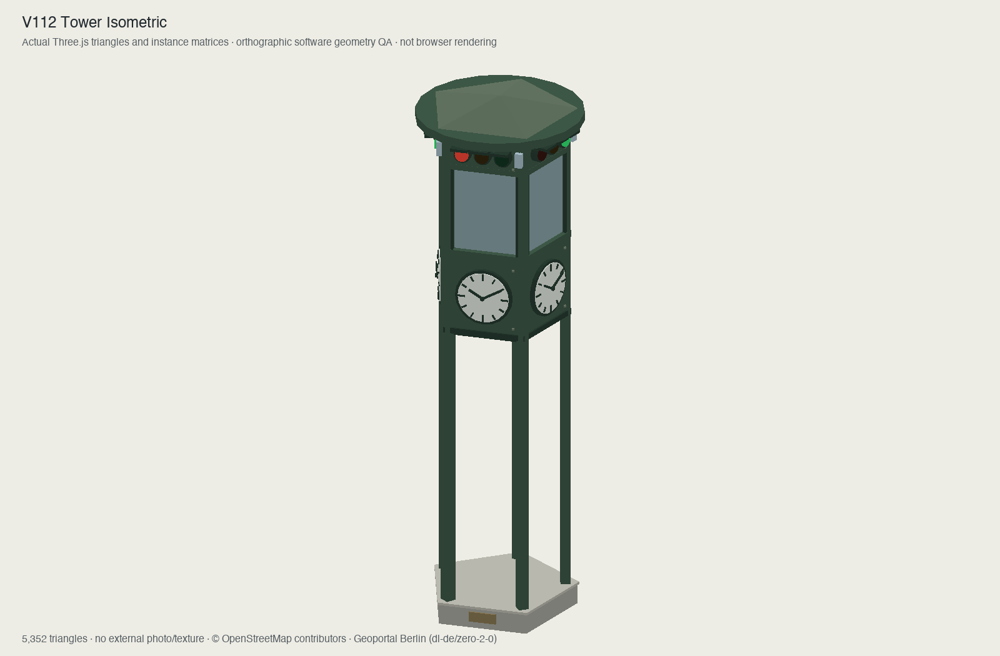
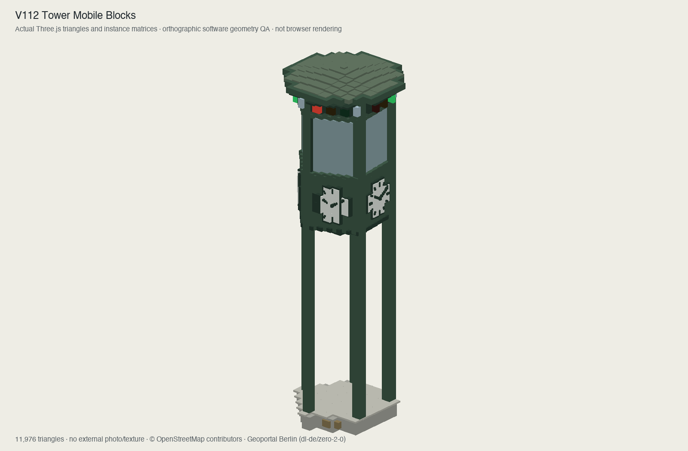

# v1.0.12 review and verification

This release addresses delayed distant buildings on mobile and the historical
traffic tower at Potsdamer Platz. Existing controls, architectural styling,
source bounds and the 93-place catalogue remain unchanged.

## Findings and fixes

| Finding | Resolution |
| --- | --- |
| Initial mobile view contained only 160 exact source building parts; the rest depended on another worker fetch/build | Publish complete compact building coverage before the interactive preview is ready. |
| Pausing an unfinished worker removed distant coverage again | Keep fallback geometry in the main world; restore it before disposing partial exact batches. |
| Worker failure could leave districts absent | Preserve permanent coverage and only hide a fallback after its exact replacement is attached. |
| One local office-footprint test scanned all 37 edges for every distant point | Reject points outside its conservative bounds first; full-city shell matrix/colour bytes remain identical. |
| The far clipping plane missed a real opposite-edge building from an allowed extreme camera | Derive depth from the actual envelope and maximum orbit; current isometric views use 18 km. |
| Traffic tower was square, solid and permanently multicoloured | Use the retained OSM centroid, five open supports, five clocks, glazed cabin and horizontal signals. |
| Initial native tower material requested a missing vertex-colour attribute | Use instance colours for cubes and verify material/attribute contracts. |
| A signal change could be missed by a still-view early return | Check visible phase changes before the idle gate; retain invalidation until rendering. |
| A legacy release guard rejected any seconds conversion as a quality switch | Permit object animation clocks; retain and negatively test concrete input-driven quality switches. |

Separate agents reviewed mobile coverage, clipping and runtime tower integration.
Independent tests verify actual attachment/failure functions, source geometry,
material restoration and the office boundary filter. No blocking finding remains.

## Verification

- Complete source coverage checked for both profiles using all 29,818 original
  records, with geometric containment, source partition and buffer-budget checks.
- Mobile startup coverage: two shell draws / 2,239,044 buffer bytes. After exact
  refinement only 260,684 additional hidden fallback bytes remain for restart.
- Actual production lifecycle tests cover attachment, pause, restart, unavailable
  worker, decode failure, acknowledgement failure and all drawn modes.
- All source roof corners checked from extreme navigation targets; the old
  16 km clipping failure is reproduced and corrected.
- Final tower/model/motion/generic monument checks: 33 tests / 19,197 assertions.
  Native full/mobile Minecraft and night lights-off restoration are included.
- Python: all 357 tests passed. Ruff format and lint passed.
- TypeScript and production build passed. Release readiness and local package
  server smoke test passed for v1.0.12.
- Full frontend suite: all 1,780 tests passed (220 files, 6,850,392 assertions).
- Both independent 255-record credit prefixes remain unchanged; each now has
  258 unique entries. All original fusion fields/features are unchanged, with
  one appended recognition supplement and one explicit display conflict.

The controlled all-source shell CPU sample fell from 213 ms to 51 ms, with
identical matrix/colour SHA256. The production-payload mobile harness built its
complete preview at 1,421 ms and received exact refinement at 1,714 ms; shell
construction cost 57 ms. These are local CPU observations, not iPhone load-time,
GPU memory or FPS measurements. The detailed budgets and reproduction commands
are in [progressive loading](performance-progressive-loading.md).

## Appearance and limits

The current replica is anchored to retained OSM way `241572310`. Its published
8.50 m height, five-sided construction and horizontal signal arrangement are
supported by Berlin's transport history and the sculpture inventory. Exact
present-day switching timings are not publicly documented in the inspected
sources: the 36-second cycle is explicitly an illustrative approximation.
See [source evidence and uncertainty](potsdamer-traffic-tower.md).

These images render actual Three.js triangles, transforms and material colours
with an orthographic software renderer. They are geometry QA, not browser
screenshots or evidence of device performance.

The Mac remained locked, preventing direct browser interaction. Physical iPhone
rendering and GPU appearance were not verified. Automated geometry, clipping,
state transitions and signal animation checks passed as described above.
